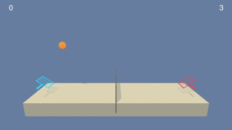

# Project 3: Collaboration and Competition

## Introduction
This project is one of the assignments in [Deep Reinforcement Learning Nanodegree Program](https://www.udacity.com/course/deep-reinforcement-learning-nanodegree--nd893), offered by Udacity.  

For this project, we're attempting to solve the the Tennis environment.
The goal in this project is to train two agents controlling rackets to bounce a ball over a net.  
  

## Getting started

1. Download the environment from one of the links below and decompress the file into your project folder.  
You need only select the environment that matches your operating system:

- Linux: [click here](https://s3-us-west-1.amazonaws.com/udacity-drlnd/P3/Tennis/Tennis_Linux.zip)
- Mac OSX: [click here](https://s3-us-west-1.amazonaws.com/udacity-drlnd/P3/Tennis/Tennis.app.zip)
- Windows (32-bit): [click here](https://s3-us-west-1.amazonaws.com/udacity-drlnd/P3/Tennis/Tennis_Windows_x86.zip)
- Windows (64-bit): [click here](https://s3-us-west-1.amazonaws.com/udacity-drlnd/P3/Tennis/Tennis_Windows_x86_64.zip)
    
    (_For Windows users_) Check out [this link](https://support.microsoft.com/en-us/help/827218/how-to-determine-whether-a-computer-is-running-a-32-bit-version-or-64) if you need help with determining if your computer is running a 32-bit version or 64-bit version of the Windows operating system.  

    (_For AWS_) If you'd like to train the agent on AWS (and have not [enabled a virtual screen](https://github.com/Unity-Technologies/ml-agents/blob/master/docs/Training-on-Amazon-Web-Service.md)), then please use [this link](https://s3-us-west-1.amazonaws.com/udacity-drlnd/P3/Tennis/Tennis_Linux_NoVis.zip) to obtain the "headless" version of the environment.  You will **not** be able to watch the agent without enabling a virtual screen, but you will be able to train the agent.  (_To watch the agent, you should follow the instructions to [enable a virtual screen](https://github.com/Unity-Technologies/ml-agents/blob/master/docs/Training-on-Amazon-Web-Service.md), and then download the environment for the **Linux** operating system above._)

2. Unzip (or decompress) the downloaded file and place it in your working folder.
3. Start by making sure that you have all the packages detailed in `environment.txt`.
    * You may do so by:
        a) Activating your virtual environment
        b) running the command `pip install -r requirements.txt `
4. Then, open the `Tennis.ipynb` and run the cells sequentially to initiate the process of agent interacting with environment while learning before achieving an average score of >=0.5 (average over 100 episodes). 

## Understanding the environment

In this environment, two agents control rackets to bounce a ball over a net. If an agent hits the ball over the net, it receives a reward of +0.1. If an agent lets a ball hit the ground or hits the ball out of bounds, it receives a reward of -0.01. Thus, the goal of each agent is to keep the ball in play.

The observation space consists of 8 variables corresponding to the position and velocity of the ball and racket. Each agent receives its own, local observation. Two continuous actions are available, corresponding to movement toward (or away from) the net, and jumping.

The task is episodic, and in order to solve the environment, your agents must get an average score of +0.5 (over 100 consecutive episodes, after taking the maximum over both agents). Specifically,

After each episode, we add up the rewards that each agent received (without discounting), to get a score for each agent. This yields 2 (potentially different) scores. We then take the maximum of these 2 scores.
This yields a single score for each episode.

Note
The project environment is similar to, but not identical to the Tennis environment on the Unity ML-Agents GitHub page.

#### Solving the environment

The environment is considered solved, when the average (over 100 episodes) of those scores is at least +0.5.

## Included in this repository

* The code used to create and train the Agent
  * Tennis.ipynb
* The trained model
  * checkpoint_actor_0.pth
  * checkpoint_actor_1.pth
  * checkpoint_critic_0.pth
  * checkpoint_critic_1.pth
* A report describing the development process and ideas for future work
  * Report.md 
* Versions of various packages required to ensure smooth running of 'Continuous_Control_Final.ipynb' 
  * requirements.txt
* This README.md file

